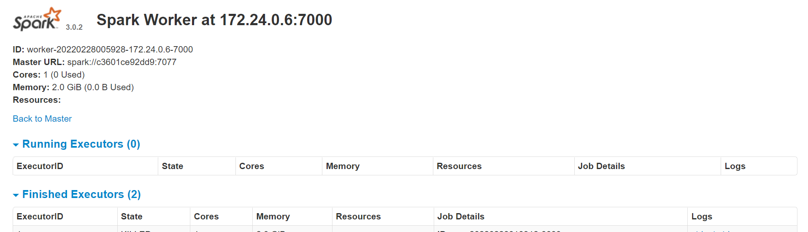
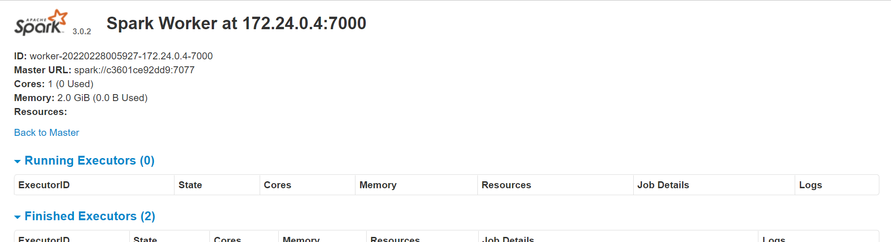
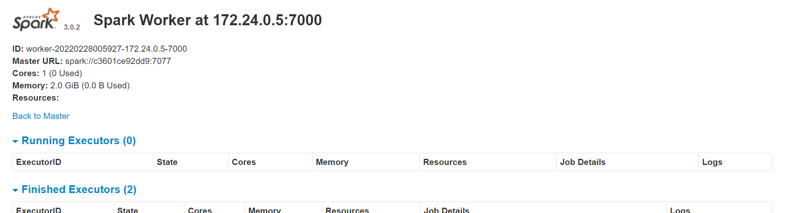

# Cluster Spark com Docker & docker-compose

# Geral

Um simples cluster spark standalone para ambiente de teste. Uma solução *docker-compose* para um ambiente de desenvolvimento Spark.

Este docker-compose criará os seguintes contêineres:

container|portas
---|---
spark-master|9090 7077
spark-worker-1|9091
spark-worker-2|9092
spark-worker-3|9093
demo-mysql|3306


# Instalação

As etapas a seguir farão com que você execute os contêineres do seu cluster Spark.

## Pre requisitos

* Docker instalado

* Docker compose instalado

## Build da imagem


```sh
docker build -t cluster-apache-spark:3.0.2 .
```

## Execute o docker-compose

Para criar o cluster de teste execute o arquivo docker-compose:

```sh
docker-compose up -d
```

## Validando o cluster

Valide seu cluster acessando a interface do Spark em cada URL.

### Spark Master

http://localhost:9090/


### Spark Worker 1

http://localhost:9091/



### Spark Worker 2

http://localhost:9092/



### Spark Worker 3

http://localhost:9093/




# Alocação de recursos 

Este cluster contêm três trabalhadores e um spark master, cada um deles tem um conjunto específico de alocação de recursos (basicamente alocação de núcleos de RAM e CPU).

* A alocação de núcleos de CPU padrão para cada trabalhador spark é 1 núcleo.

* A RAM padrão para cada spark-worker é de 2G.

* A alocação de RAM padrão para executores de faísca é 2G.

* A alocação de RAM padrão para o driver de ignição é de 2G

* Se você deseja modificar essas alocações, basta editar no docker-compose.


# Volumes Bind

Para facilitar a execução do aplicativo, foi montado os volumes descritas no gráfico a seguir:

Endereço Host|Endereço Contêiner|Propósito
---|---|---
apps|/opt/spark-apps| Usado para disponibilizar os .py do seu aplicativo para todos os workers e master
data|/opt/spark-data| Usado para disponibilizar os dados de saída da aplicação para todos os workers e master


# Rodando a aplicação de forma simples

## Base de dados fictícia e aleatória

Como o Github tem uma limitação de upload de arquivos, eu decidi compactar a base.
Basta descompactar o arquivo (com o descompactador de sua preferência) e subir a base de dados para o container de Banco de Dados MySQL, conforme o comando abaixo:

```sh
docker cp base_ficticia/sistema-banco.sql ci_cd-spark-demo-mysql-1:/tmp
```

Para fazer o upload do arquivo na base, basta rodar o comando abaixo:

```sh
docker exec -i ci_cd-spark-demo-mysql-1 /bin/bash -c "cd /tmp && mysql -h localhost -uroot -pfagner_correa < sistema-banco.sql"
```

Para executar o aplicativo, conecte-se ao master executando:

```sh
docker exec -i ci_cd-spark-spark-master-1 /bin/bash -c "/opt/spark/bin/spark-submit --master spark://spark-master:7077 \
--packages mysql:mysql-connector-java:5.1.49 \
--driver-memory 2G \
--executor-memory 2G \
/opt/spark-apps/main.py"
```

## Observações

### O porquê optei por este design:

* Optei por spark standalone por seu modelo de computação distribuída e pela praticidade em rodar em um notebook/desktop, útil também para usar em pipelines de CI/CD;
* Optei por MySQL porque é um banco de dados robusto (quando bem dimensionado), tem uma comunidade bem ativa e, entre os bancos de dados que eu ja trabalhei, é o que tenho maior experiencia;
* Optei pelo Docker porque é uma arquitetura rápida de montar para uma infraestrutura de CI/CD e microsserviços, além de ser, também, a que possuo mais experiencia.	
	
### o que faria se tivesse mais tempo para concluir este desafio:

* Teria automatizado mais, quem sabe montado toda a IAC (criação da máquina virtual, instalação dos recursos de máquina e execução da aplicação, etc.) e CI/CD (talvez com o Jenkins, com o qual eu ja trabalhei).
* Teria Estruturado melhor o Banco de Dados para a consulta ficar mais rápida, é o que está tomando mais tempo no processo.
	

### dificuldades que encontrou no desenvolvimento:

* Demorei para gerar uma base fictícia concisa, esta base foi gerada com ajuda do site <a href="https://www.4devs.com.br/gerador_de_pessoas">4Devs</a>.
