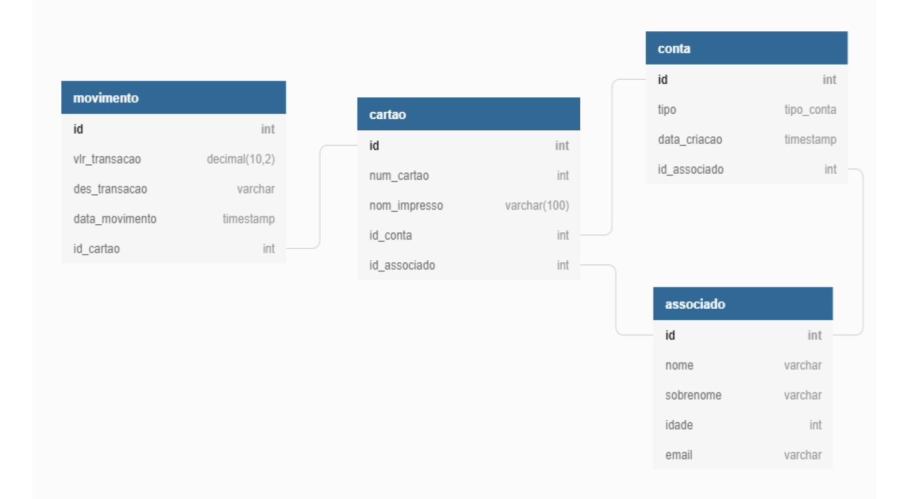
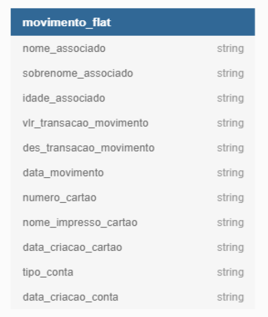

# Cluster Spark com Docker & docker-compose

# Geral

Um simples cluster spark standalone para ambiente de teste. Uma solução *docker-compose* para um ambiente de desenvolvimento Spark.

Este docker-compose criará os seguintes contêineres:

container|portas
---|---
spark-master|9090 7077
spark-worker-1|9091
spark-worker-2|9092
spark-worker-3|9093
demo-mysql|3306


# Instalação

As etapas a seguir farão com que você execute os contêineres do seu cluster Spark.

## Pre requisitos

* Docker instalado (versão mínima 20.10.12)

* Docker compose instalado (versão mínima 2.2.3)

## Build da imagem


```sh
docker build -t cluster-apache-spark:3.0.2 .
```

## Execute o docker-compose

Para criar o cluster execute o arquivo docker-compose:

```sh
docker-compose up -d
```

## Validando o cluster

Valide seu cluster acessando a interface do Spark em cada URL:

### Spark Master

http://localhost:9090/


### Spark Worker 1

http://localhost:9091/


### Spark Worker 2

http://localhost:9092/


### Spark Worker 3

http://localhost:9093/


# Alocação de recursos 

Este cluster contêm três workers e um spark master, com os recursos organizados da seguinte maneira (alocação de Cores, RAM e CPU):

* SPARK_WORKER_CORES = 1

* SPARK_WORKER_MEMORY = 1G

* SPARK_DRIVER_MEMORY = 1G

* SPARK_EXECUTOR_MEMORY = 1G

* Se você deseja modificar essas alocações, basta editar no docker-compose e na chamada da aplicação.


# Volumes Bind

Para facilitar a execução do aplicativo, foi montado os volumes descritas no gráfico a seguir:

Endereço Host|Endereço Contêiner|Propósito
---|---|---
/apps|/opt/spark-apps| Usado para disponibilizar os .py do seu aplicativo para todos os workers e master
/data|/opt/spark-data| Usado para disponibilizar os dados de saída da aplicação para todos os workers e master


# Rodando a aplicação

## Carregar Base de Dados fictícia e aleatória

### Estrutura do Banco de Dados



### Estrutura do arquivo exportado



### Carregando o banco de dados

Como o Github tem uma limitação de upload de arquivos, foi necessário compactar a base.
Basta descompactar o arquivo (com o descompactador de sua preferência) onde ele está (dentro de /base_ficticia).
Para enviar a base de dados para o container de Banco de Dados, execute o comando a seguir na pasta raiz do projeto:

```sh
docker cp base_ficticia/sistema-banco.sql ci_cd-spark-demo-mysql-1:/tmp
```

Após enviar a base de dados para o container, execute o comando a seguir para carregar a essa base no banco de dados:

```sh
docker exec -i ci_cd-spark-demo-mysql-1 /bin/bash -c "cd /tmp && mysql -h 172.16.238.14 -uroot -pfagner_correa < sistema-banco.sql"
```

Para executar a aplicação, execute o seguinte comando:

```sh
docker exec -i ci_cd-spark-spark-master-1 /bin/bash -c "/opt/spark/bin/spark-submit --master spark://spark-master:7077 \
--packages mysql:mysql-connector-java:5.1.49 \
--driver-memory 1G \
--executor-memory 1G \
/opt/spark-apps/main.py"
```

## Observações

### O porquê optei por este design:

* Optei por spark standalone por seu modelo de computação distribuída e pela praticidade em rodar em um notebook/desktop, simples inclusive para usar em pipelines de CI/CD;
* Optei por MySQL porque é um banco de dados robusto (quando bem dimensionado), tem uma comunidade bem ativa e, entre os bancos de dados que eu ja trabalhei, é o que tenho maior experiencia;
* Optei pelo Docker porque é uma arquitetura rápida de montar para uma infraestrutura de CI/CD e microsserviços, além de ser, também, a que possuo mais experiencia.	
	
### O que eu faria se tivesse mais tempo para este projeto:

Levei dois dias para desenvolver este projeto. Se eu tivesse mais tempo:

* teria automatizado mais, quem sabe montado toda a IAC (criação da máquina virtual, instalação dos recursos de máquina e execução da aplicação, etc.) e CI/CD (talvez com o Jenkins, com o qual eu ja trabalhei);
* teria pesquisado uma fonte de dados API para coletar as informações para este projeto;
* teria Estruturado melhor o Banco de Dados para a consulta ficar mais rápida, é o que está tomando mais tempo no processo;
	

### Dificuldades que encontrei no projeto:

* Demorei para gerar uma base fictícia concisa, esta base foi gerada com ajuda do site <a href="https://www.4devs.com.br/gerador_de_pessoas">4Devs</a>.
