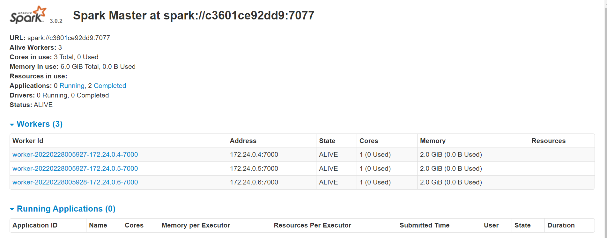

# Cluster Spark com Docker & docker-compose

# Geral

Um simples cluster spark standalone para ambiente de teste. Uma solução *docker-compose* para um ambiente de desenvolvimento Spark.

Este docker-compose criará os seguintes contêineres:

container|portas
---|---
spark-master|9090 7077
spark-worker-1|9091
spark-worker-2|9092
spark-worker-3|9093
demo-mysql|3306


# Instalação

As etapas a seguir farão com que você execute os contêineres do seu cluster Spark.

## Pre requisites

* Docker instalado

* Docker compose instalado

## Build da imagem


```sh
docker build -t cluster-apache-spark:3.0.2 .
```

## Execute o docker-compose

Para criar o cluster de teste execute o arquivo docker-compose:

```sh
docker-compose up -d
```

## Validando o cluster

Valide seu cluster acessando a interface do Spark em cada URL.

### Spark Master

http://localhost:9090/



### Spark Worker 1

http://localhost:9091/


### Spark Worker 2

http://localhost:9092/


### Spark Worker 3

http://localhost:9093/


# Alocação de recursos 

Este clustercontêm três trabalhadores e um spark master, cada um deles tem um conjunto específico de alocação de recursos (basicamente alocação de núcleos de RAM e CPU).

* A alocação de núcleos de CPU padrão para cada trabalhador spark é 1 núcleo.

* A RAM padrão para cada spark-worker é de 2G.

* A alocação de RAM padrão para executores de faísca é 2G.

* A alocação de RAM padrão para o driver de ignição é de 2G

* Se você deseja modificar essas alocações, basta editar no docker-compose.


# Volumes Bind

Para facilitar a execução do aplicativo, foi montado os volumes descritas no gráfico a seguir:

Endereço Host|Endereço Contêiner|Propósito
---|---|---
apps|/opt/spark-apps| Usado para disponibilizar os .py do seu aplicativo para todos os workers e master
data|/opt/spark-data| Usado para disponibilizar os dados de saída da aplicação para todos os workers e master


# Rodando a aplicação de forma simples

## Base de dados fictícia e aleatória

Para subir a base de dados para o Banco de Dados MySQL, basta copiar os dados para dentro do container ...

```sh
docker cp base_ficticia/sistema-banco.sql ci_cd-spark-demo-mysql-1:/tmp
```

... e executar o comando de upload do arquivo no Banco de Dados.

```sh
docker exec -i ci_cd-spark-demo-mysql-1 /bin/bash -c "cd /tmp && mysql -h 192.168.0.21 -uroot -pfagner_correa < sistema-banco.sql"
```

Para executar o aplicativo, conecte-se ao master executando:

```sh
docker exec -i ci_cd-spark-spark-master-1 /bin/bash -c "/opt/spark/bin/spark-submit --master spark://spark-master:7077 \
--packages mysql:mysql-connector-java:5.1.49 \
--driver-memory 2G \
--executor-memory 2G \
/opt/spark-apps/main.py"
```

# Por que um cluster standalone?

* Destinado para fins de teste, basicamente para executar aplicativos Spark distribuídos no laptop ou no desktop.

* Útil também para usar em pipelines de CI/CD e para seus aplicativos Spark.